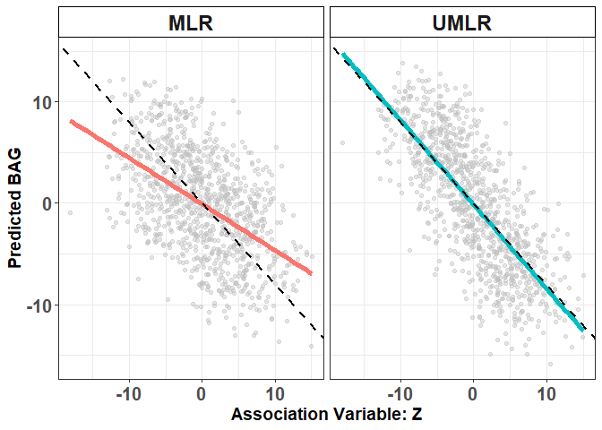

Systematic Prediction Bias
================

**`Lasso_UP`** is the primary function that implements UMLR (Lasso version with constrainst (unbiased lasso)):

``` r{class.source="fold-show"}
Lasso_UP(Predictor, Outcome, Lambda)
```

-   Inputs
    -   `Predictor` : Predictor matrix (n x p)
    -   `Outcome` : Outcome vector (n x 1)
    -   `Lambda` : Tuning parameter
-   Output
    -   `betahat` : Estimated regression coefficients
    -   `predict` : Predicted outcome

# Data Generation

Load required libraries for competing methods

``` r
setwd("C:\\Users\\hylee\\Documents\\Research\\Aging\\Demo_Illustration")

library(MASS)
library(reshape2)
library(ggplot2)
library(glmnet)
library(xgboost)
library(randomForest)
library(constrLasso)
library(xtable)
library(ggh4x)
library(scales)
library(neuralnet)
library(e1071)

source("Lasso_UP.R")
```

## Generating Training data set

``` r
set.seed(1)
N <- 1000
p <- 2 

# Generate Outcomes (chronological age and Biological Age)
Y <- round(runif(N,40,70)) # Chronological Age (Observed)
E <- runif(N,-10,10) # Biological Age Acceleration (BAG)
Bage <- Y + E # Biological Age (Latent)


# Generate the association variable Z
Noise <- rnorm(N,0,sqrt(20^2/12))
rho <- -0.8 # Correlation between Z and E
a <- rho
b <- sqrt(1 - rho^2)
Z <- a *E + b * Noise


# Generate the predictor X
sigma_x <- 0.1
mx <- scale(Bage)
X <- t(sapply(1:N, function(i) mvrnorm(1,rep(mx[i],p),sigma_x*diag(p))))

lower.train <- which(Y<quantile(Y)[2])
upper.train <- which(Y>quantile(Y)[4])
```

## Generating Testing data set

``` r
Nt <- 1000
# Generate Testing set
Y.test <- round(runif(Nt,40,70)) # Chronological Age (Observed)
E.test <-runif(N,-10,10) # Biological Age Acceleration (BAG)
Bage.test <- Y.test + E.test # Biological Age (Latent)

# Generate the association variable Z
Noise.test <- rnorm(N,0,sqrt(20^2/12))
Z.test <- a *E.test + b * Noise.test


# Generate the predictor X
mx.test <- scale(Bage.test)
X.test <- t(sapply(1:N, function(i) mvrnorm(1,rep(mx.test[i],p),sigma_x*diag(p))))

# Lower & Upper test
lower.test <- which(Y.test<quantile(Y.test)[2])
upper.test <- which(Y.test>quantile(Y.test)[4])
```

# Model fitting

## Unbiased Machine Learning Regression (UMLR: Lasso version)

``` r
lassoup.fit <- Lasso_UP(cbind(1,X),Y,lambda=0.1)
Classo.est.train  <- lassoup.fit$predict
Classo.est.test  <- cbind(1,X.test)%*%lassoup.fit$betahat
```

## Lasso

``` r
lasso <- cv.glmnet(X,Y)
lasso.est.train <- predict(lasso,X,s="lambda.1se")[,1]
lasso.est.test <- predict(lasso,X.test,s="lambda.1se")[,1]
```

## Gradient Boosting (XGBoost Squared Loss)

``` r
xgboost.result <- xgboost(data=X,label=Y,nrounds = 20,objective = "reg:squarederror")
xgboost.est.train <- predict(xgboost.result,X)
xgboost.est.test <- predict(xgboost.result,X.test)
```

### XGBoost (Huber Loss)

``` r
Huber.result <- xgboost(data=X,label=Y,nrounds = 20,objective = "reg:pseudohubererror",eval_metric="mphe",huber_slope=50)
Huber.est.train <-predict(Huber.result,X)
Huber.est.test <- predict(Huber.result,X.test)
```

### XGBoost (MAE Loss)

``` r
dtrain <- xgb.DMatrix(data = as.matrix(X), label = as.numeric(Y))
dtest  <- xgb.DMatrix(data = as.matrix(X.test))
params <- list(
  objective   = "reg:absoluteerror",
  eval_metric = "mae",
  base_score  = median(Y),   # CRITICAL
  eta         = 0.05,
  max_depth   = 4,
  subsample   = 0.8,
  colsample_bytree = 0.8,
  lambda      = 1
)

Median.result <- xgb.train(
  params  = params,
  data    = dtrain,
  nrounds = 5000,
  watchlist = list(train = dtrain),
  verbose = 0
)

Median.est.train <- predict(Median.result, dtrain)
Median.est.test  <- predict(Median.result, dtest)
```

## Random Forest

``` r
randomforest.result <- randomForest(x=X,y=as.vector(Y))
rf.est.train <- predict(randomforest.result,X)
rf.est.test <- predict(randomforest.result,X.test)
```

## Neural Net

``` r
data <- data.frame(X,Y)
data.test <- data.frame(X.test,Y.test)
variables <- paste("X", 1:p, sep="")
formula_string <- paste(variables, collapse=" + ")
formula <- as.formula(paste("Y ~", formula_string))
NN = neuralnet(
  formula,
  data=data,
  hidden=2*p,
  linear.output=T,
  threshold=0.5
)
NN.est.train <- predict(NN,data)
NN.est.test <- predict(NN,data.test)
```

## Support Vector Regression

``` r
svm_model <- svm(formula,data)
svm.est.train <- predict(svm_model,data)
svm.est.test <- predict(svm_model,data.test)
```

## OLS

``` r
LM.result <- lm(Y ~ X)
LM.est.train <-LM.result$fitted.values
LM.est.test <- cbind(1,X.test)%*%LM.result$coefficients
```

# Result

## Systematic Prediction Bias from various ML Methods (Predicted outcome vs Observed outcome) in testing set

``` r
#### Figures 
Fitted <- data.frame(Y,Classo.est.train,lasso.est.train,svm.est.train,xgboost.est.train,Huber.est.train,Median.est.train,rf.est.train,NN.est.train,LM.est.train)
colnames(Fitted) <- c("Y","Constrained Lasso","Lasso","SVR","XGboost (Squared)","XGboost (Huber)","XGboost (L1)","RF","NN","Reg")
melted.data <- melt(Fitted,id='Y')
melted.data$variable <- factor(melted.data$variable ,levels=c("XGboost (Squared)","RF","SVR","NN","Lasso","XGboost (Huber)","XGboost (L1)","Reg",
                                                              "Constrained Lasso"))


## Testing
Fitted.test <- data.frame(Y.test,Classo.est.test,lasso.est.test,svm.est.test,xgboost.est.test,Huber.est.test,Median.est.test,rf.est.test,NN.est.test,LM.est.test)
colnames(Fitted.test) <- c("Y","Constrained Lasso","Lasso","SVR","XGboost (Squared)","XGboost (Huber)","XGboost (L1)","RF","NN","Reg")
melted.data.test <- melt(Fitted.test,id='Y')
melted.data.test$variable <- factor(melted.data.test$variable ,levels=c("XGboost (Squared)","RF","SVR","NN","Lasso","XGboost (Huber)","XGboost (L1)","Reg",
                                                                        "Constrained Lasso"))


### Fitted Merge
melted.scatter.train <- cbind(melted.data,"Training")
melted.scatter.test <- cbind(melted.data.test,"Testing")
colnames(melted.scatter.train)[4] <- c("Source")
colnames(melted.scatter.test)[4] <- c("Source")
melted.scatter <- rbind(melted.scatter.train,melted.scatter.test)
melted.scatter$Source <- factor(melted.scatter$Source,levels=c("Training","Testing"))
strip <- strip_themed(background_y = elem_list_rect(fill=alpha(hue_pal()(2),0.3)))


library(dplyr)
library(broom)

stat_df <- melted.scatter %>%
  filter(Source == "Testing") %>%
  group_by(variable) %>%
  do({
    fit <- lm(value ~ Y, data = .)
    data.frame(
      slope = coef(fit)[2],
      R2    = summary(fit)$r.squared
    )
  })


custom_order <- c("XGboost (Squared)", "RF", "SVR","NN","Lasso", 
                  "Reg","XGboost (Huber)","XGboost (L1)")
melted.scatter2 <- melted.scatter[which(melted.scatter$variable %in% custom_order),]
melted.scatter2$variable <- factor(melted.scatter2$variable, levels = custom_order)


custom_labels <- c(
  #"Constrained Lasso" = "<span style='color:red;'>Constrained<br>LASSO</span>",
  "XGboost (Huber)" = "<span style='color:black;'>XGBoost<br>(Huber Loss)</span>",
  "XGboost (L1)" = "<span style='color:black;'>XGBoost<br>(MAE Loss)</span>",
  "XGboost (Squared)" = "<span style='color:black;'>XGBoost</span>",
  "RF" = "<span style='color:black;'>Random<br>Forest</span>",
  "SVR" = "<span style='color:black;'>Support Vector<br>Regression</span>",
  "NN" = "<span style='color:black;'>Neural<br>Network</span>",
  "Reg" ="<span style='color:black;'>OLS</span>"
)
Fig2A_Age <- ggplot(melted.scatter2[which(melted.scatter2$Source=="Testing"),],aes(x=Y,y=value))+
  geom_point(aes(x=Y,y=value),colour="gray",alpha=0.3,size = 1)+
  facet_wrap(~variable, nrow = 2, labeller = labeller(variable = custom_labels)) +
  geom_abline(slope=0,intercept=0,col="black",linetype="dashed")+
  geom_smooth(method="lm",aes(col=variable), size = 1.5)+
  geom_abline(slope = 1, intercept = 0, linetype = "dashed") + 
  #xlab("Age")+
  #ylab("Estimated Brain Age Gap")+
  #scale_x_continuous(limits = c(0.4, 0.65), breaks = seq(0.4, 0.65, by = 0.1))+
  #scale_y_continuous(limits = c(0.4, 0.65), breaks = seq(0.4, 0.65, by = 0.1))+
  theme_bw()+
  xlab("Observed Outcome") +
  ylab("Predicted Outcome") +
  theme( legend.position = "none",
         plot.title = element_text(size = 12, face = "bold"),  
         # axis.title.x = element_text(size = 14, face = "bold"), 
         axis.text.y = element_text(size = 13, face = "bold"), 
         axis.text.x = element_text(size = 13, face = "bold"), 
         # axis.title.y = element_text(size = 14, face = "bold"), 
         axis.title = element_blank(),
         strip.text.x = ggtext::element_markdown(size = 13, face = "bold"),
         strip.background = element_rect(fill = "white", colour = "black"),
         strip.placement = "outside",
         panel.spacing = unit(0.1, "lines")  # Adjust spacing between panels
  )

Fig2A_Age
```


## Comparison (MLR vs UMLR) in Prediction

### Training Set (Predicted outcome vs Observed Outcome)

``` r
Pred.Train <- data.frame(Y,lasso.est.train,Classo.est.train)
colnames(Pred.Train) <- c("Y","MLR","UMLR")
Pred.Train <- melt(Pred.Train,id="Y")
colnames(Pred.Train) <- c("Y","Method","Pred")

p <- ggplot(Pred.Train, aes(x = Y, y = Pred)) +
  geom_point(color = "gray",alpha=0.4) +
  geom_smooth(method = "lm",aes(color = Method),se = FALSE,linewidth=1.8) +
  geom_abline(slope = 1, intercept = 0, linetype = "dashed",linewidth=1) +
  facet_wrap(~Method)+
  xlab("Observed Outcome") +
  ylab("Predicted Outcome") +
  theme_bw() +
  theme_bw() +
  theme(legend.position = "none",
        strip.text = element_text(face = "bold", size = 17),   # facet labels bold
        strip.background = element_rect(fill = "white", colour = "black"),
        axis.title.x = element_text(face = "bold", size = 14), # x-axis label bold
        axis.title.y = element_text(face = "bold", size = 14), # y-axis label bold
        axis.text.x = element_text(face = "bold", size = 15),  # x-axis tick labels bold
        axis.text.y = element_text(face = "bold", size = 15)   # y-axis tick labels bold
  )
print(p)
```


### Testing Set (Predicted outcome vs Observed Outcome)

``` r
Pred.Test <- data.frame(Y.test,lasso.est.test,Classo.est.test)
colnames(Pred.Test) <- c("Y","MLR","UMLR")
Pred.Test <- melt(Pred.Test,id="Y")
colnames(Pred.Test) <- c("Y","Method","Pred")

p <- ggplot(Pred.Test, aes(x = Y, y = Pred)) +
  geom_point(color = "gray",alpha=0.4) +
  geom_smooth(method = "lm",aes(color = Method),se = FALSE,linewidth=1.8) +
  geom_abline(slope = 1, intercept = 0, linetype = "dashed",linewidth=1) +
  facet_wrap(~Method)+
  xlab("Observed Outcome") +
  ylab("Predicted Outcome") +
  theme_bw() +
  theme_bw() +
  theme(legend.position = "none",
        strip.text = element_text(face = "bold", size = 17),   # facet labels bold
        strip.background = element_rect(fill = "white", colour = "black"),
        axis.title.x = element_text(face = "bold", size = 14), # x-axis label bold
        axis.title.y = element_text(face = "bold", size = 14), # y-axis label bold
        axis.text.x = element_text(face = "bold", size = 15),  # x-axis tick labels bold
        axis.text.y = element_text(face = "bold", size = 15)   # y-axis tick labels bold
  )
print(p)
```


### Downsteam Association Analysis (Testing Set: Predicted BAG vs Association Variable (Z))

``` r
Asso.Test <- data.frame(Z.test,lasso.est.test-Y.test,Classo.est.test-Y.test)
colnames(Asso.Test) <- c("Z","MLR","UMLR")
Asso.Test <- melt(Asso.Test,id="Z")
colnames(Asso.Test) <- c("Z","Method","Pred")

p <- ggplot(Asso.Test, aes(x = Z, y = Pred)) +
  geom_point(color = "gray",alpha=0.4) +
  geom_smooth(method = "lm",aes(color = Method),se = FALSE,linewidth=1.8) +
  geom_abline(slope = -0.8, intercept = 0, linetype = "dashed",linewidth=1) +
  facet_wrap(~Method)+
  xlab("Association Variable: Z") +
  ylab("Predicted BAG") +
  theme_bw() +
  theme_bw() +
  theme(legend.position = "none",
        strip.text = element_text(face = "bold", size = 17),   # facet labels bold
        strip.background = element_rect(fill = "white", colour = "black"),
        axis.title.x = element_text(face = "bold", size = 14), # x-axis label bold
        axis.title.y = element_text(face = "bold", size = 14), # y-axis label bold
        axis.text.x = element_text(face = "bold", size = 15),  # x-axis tick labels bold
        axis.text.y = element_text(face = "bold", size = 15)   # y-axis tick labels bold
  )
print(p)
```


